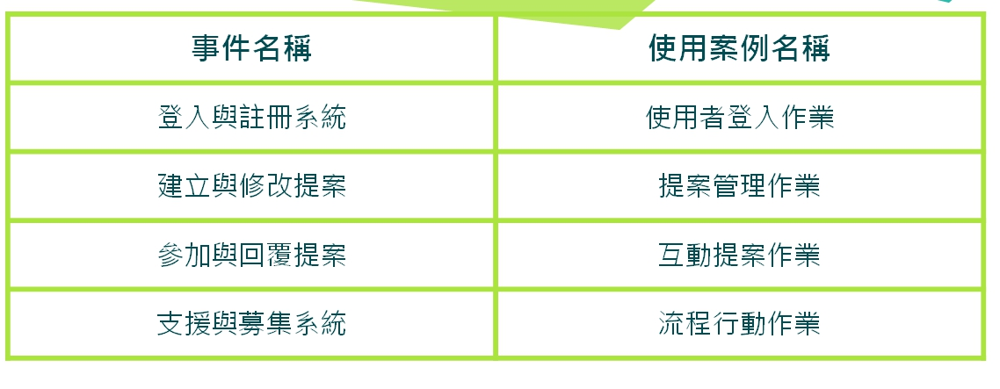
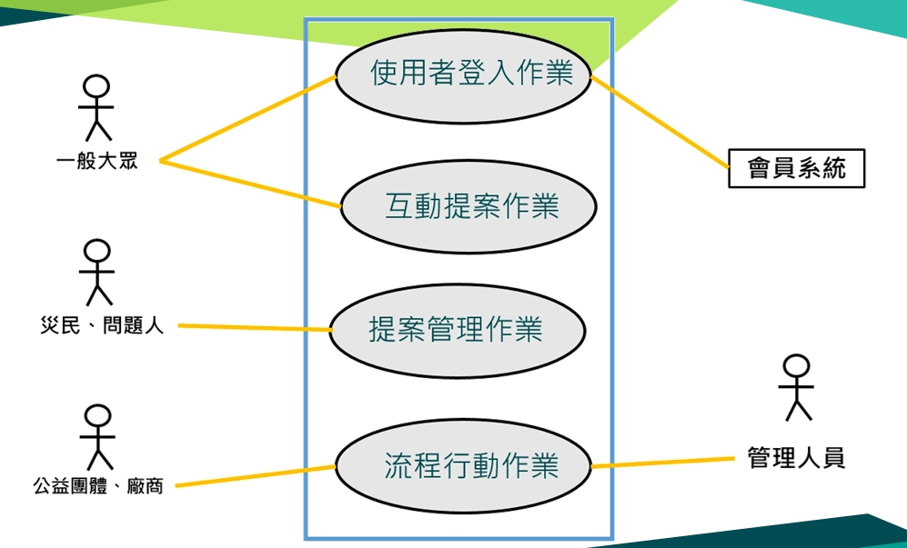
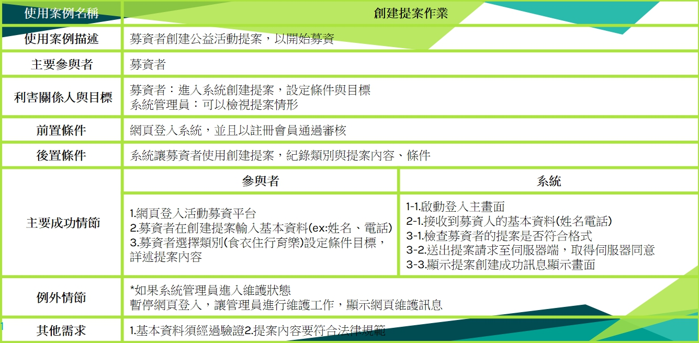
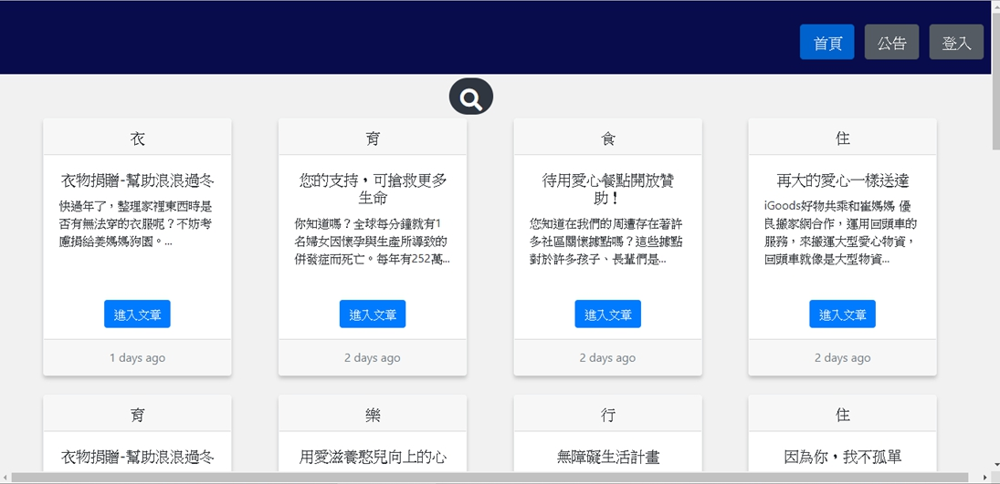
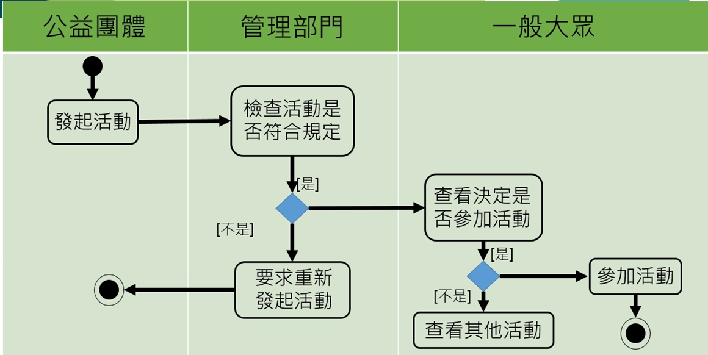
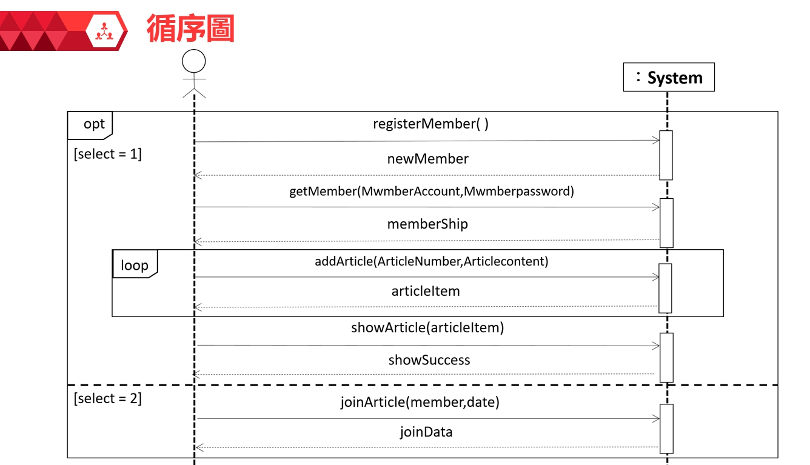
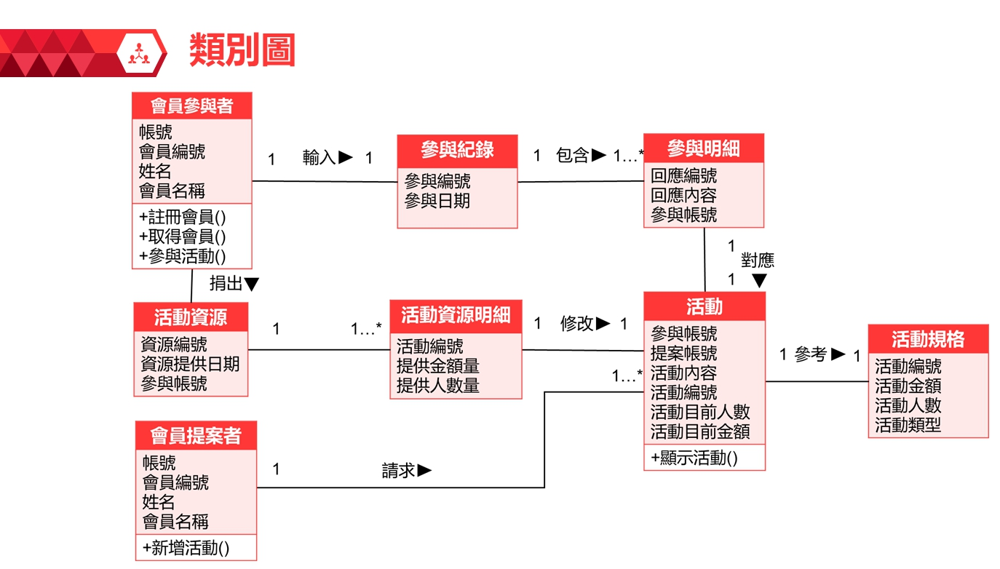
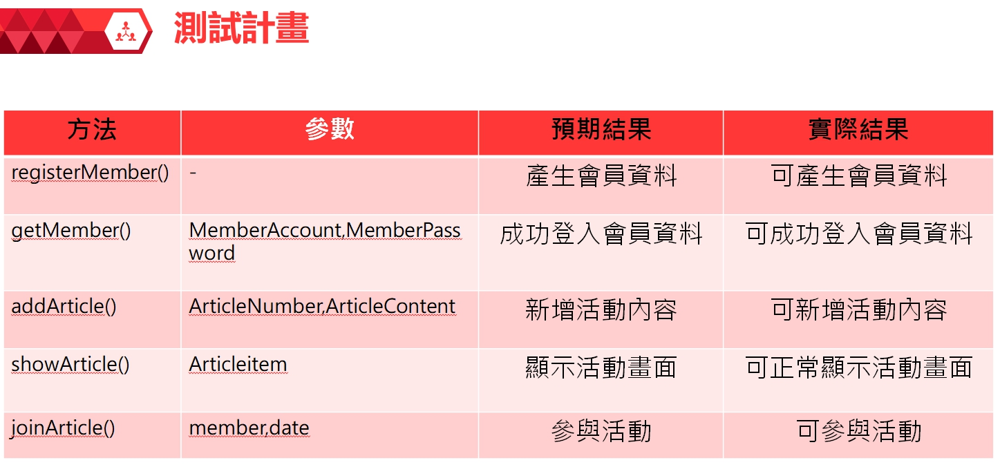

# 0524044 劉建宏

<h3>專題名稱:提案活動協助解決平台</h3>

成員:劉建宏(0524044)、陳昱翔(0524032)、郭子豪(0524019)、黃雯琪(0524024)

指導老師:張弘毅老師

<h4>專題內容描述
  

<h4>利害關係人目標表
  

<h4>事件表
  

<h4>案例圖
  

<h4>最重要的使用案例
  

<h4>系統畫面
  

<h4>系統活動圖
  

<h4>循序圖
  

<h4>類別圖
  
  

<h4>單元測試  
  
  
